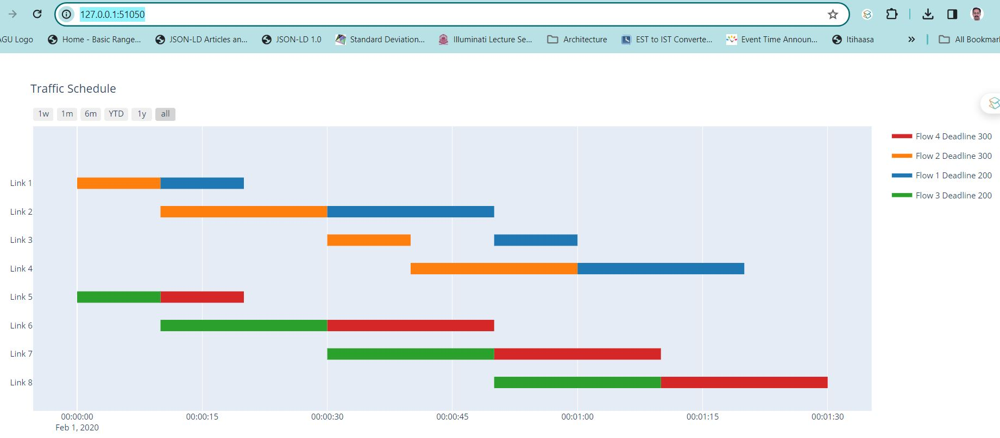

# TrafficScheduling
Traffic Scheduling for Time Sensitive Networks  

Run the program schedulegenwithdeadline.py

A brief description

Scheduling being an NPHard problem many methods have been applied.
Genetic Algorithms, Metaheuristics all have found its advantages.
I found it easier with Genetic algorithms as finally all you do is
try creating different populations and check the fitness (whether rules or constraints are met)
more relatable. This is the approach in Genetic. 

Inline image

An initial flow sequence is provided by JSON for 10 Links

The Traffic Model is here. The flows (4) are described in code here
 

Main method  
  
Include calls to prepare initial polpulation  
Multiple Iterations involved to find the best  
  
Perform mutations (rearrangements) and check fitness  
  
Identifying the best schedule by checking makespan. The Shortest Makespan is considered best  
  

